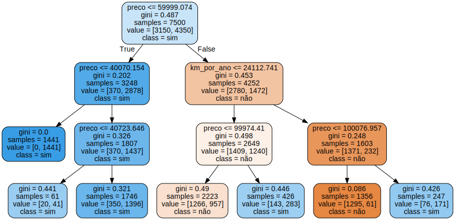

# sklearn_e_Machine_Learning

<a href="https://colab.research.google.com/github/MuriloKrominski/sklearn_e_Machine_Learning/blob/main/sklearn_e_Machine_Learning.ipynb" target="_parent"></a>


```python
!pip install graphviz==0.10
!apt-get install graphviz
```

    Collecting graphviz==0.10
      Downloading https://files.pythonhosted.org/packages/a1/33/a0d49e007ce2f55954eb5d2058817af18f4e22ea69142880e1c46d32c37b/graphviz-0.10-py2.py3-none-any.whl
    Installing collected packages: graphviz
      Found existing installation: graphviz 0.10.1
        Uninstalling graphviz-0.10.1:
          Successfully uninstalled graphviz-0.10.1
    Successfully installed graphviz-0.10
    Reading package lists... Done
    Building dependency tree       
    Reading state information... Done
    graphviz is already the newest version (2.40.1-2).
    0 upgraded, 0 newly installed, 0 to remove and 22 not upgraded.
    


```python
import pandas as pd

uri = "https://raw.githubusercontent.com/MuriloKrominski/sklearn_e_Machine_Learning/main/car-prices.csv"
dados = pd.read_csv(uri)
dados.head()
```


<div>

<table border="1" class="dataframe">
  <thead>
    <tr style="text-align: right;">
      <th></th>
      <th>Unnamed: 0</th>
      <th>mileage_per_year</th>
      <th>model_year</th>
      <th>price</th>
      <th>sold</th>
    </tr>
  </thead>
  <tbody>
    <tr>
      <th>0</th>
      <td>0</td>
      <td>21801</td>
      <td>2000</td>
      <td>30941.02</td>
      <td>yes</td>
    </tr>
    <tr>
      <th>1</th>
      <td>1</td>
      <td>7843</td>
      <td>1998</td>
      <td>40557.96</td>
      <td>yes</td>
    </tr>
    <tr>
      <th>2</th>
      <td>2</td>
      <td>7109</td>
      <td>2006</td>
      <td>89627.50</td>
      <td>no</td>
    </tr>
    <tr>
      <th>3</th>
      <td>3</td>
      <td>26823</td>
      <td>2015</td>
      <td>95276.14</td>
      <td>no</td>
    </tr>
    <tr>
      <th>4</th>
      <td>4</td>
      <td>7935</td>
      <td>2014</td>
      <td>117384.68</td>
      <td>yes</td>
    </tr>
  </tbody>
</table>
</div>


```python
a_renomear = {
    'mileage_per_year' : 'milhas_por_ano',
    'model_year' : 'ano_do_modelo',
    'price' : 'preco',
    'sold' : 'vendido'
}
dados = dados.rename(columns=a_renomear)
dados.head()
```


<div>

<table border="1" class="dataframe">
  <thead>
    <tr style="text-align: right;">
      <th></th>
      <th>Unnamed: 0</th>
      <th>milhas_por_ano</th>
      <th>ano_do_modelo</th>
      <th>preco</th>
      <th>vendido</th>
    </tr>
  </thead>
  <tbody>
    <tr>
      <th>0</th>
      <td>0</td>
      <td>21801</td>
      <td>2000</td>
      <td>30941.02</td>
      <td>yes</td>
    </tr>
    <tr>
      <th>1</th>
      <td>1</td>
      <td>7843</td>
      <td>1998</td>
      <td>40557.96</td>
      <td>yes</td>
    </tr>
    <tr>
      <th>2</th>
      <td>2</td>
      <td>7109</td>
      <td>2006</td>
      <td>89627.50</td>
      <td>no</td>
    </tr>
    <tr>
      <th>3</th>
      <td>3</td>
      <td>26823</td>
      <td>2015</td>
      <td>95276.14</td>
      <td>no</td>
    </tr>
    <tr>
      <th>4</th>
      <td>4</td>
      <td>7935</td>
      <td>2014</td>
      <td>117384.68</td>
      <td>yes</td>
    </tr>
  </tbody>
</table>
</div>


```python
a_trocar = {
    'no' : 0,
    'yes' : 1
}
dados.vendido = dados.vendido.map(a_trocar)
dados.head()
```


<div>

<table border="1" class="dataframe">
  <thead>
    <tr style="text-align: right;">
      <th></th>
      <th>Unnamed: 0</th>
      <th>milhas_por_ano</th>
      <th>ano_do_modelo</th>
      <th>preco</th>
      <th>vendido</th>
    </tr>
  </thead>
  <tbody>
    <tr>
      <th>0</th>
      <td>0</td>
      <td>21801</td>
      <td>2000</td>
      <td>30941.02</td>
      <td>1</td>
    </tr>
    <tr>
      <th>1</th>
      <td>1</td>
      <td>7843</td>
      <td>1998</td>
      <td>40557.96</td>
      <td>1</td>
    </tr>
    <tr>
      <th>2</th>
      <td>2</td>
      <td>7109</td>
      <td>2006</td>
      <td>89627.50</td>
      <td>0</td>
    </tr>
    <tr>
      <th>3</th>
      <td>3</td>
      <td>26823</td>
      <td>2015</td>
      <td>95276.14</td>
      <td>0</td>
    </tr>
    <tr>
      <th>4</th>
      <td>4</td>
      <td>7935</td>
      <td>2014</td>
      <td>117384.68</td>
      <td>1</td>
    </tr>
  </tbody>
</table>
</div>


```python
from datetime import datetime

ano_atual = datetime.today().year
dados['idade_do_modelo'] = ano_atual - dados.ano_do_modelo
dados.head()
```


<div>

<table border="1" class="dataframe">
  <thead>
    <tr style="text-align: right;">
      <th></th>
      <th>Unnamed: 0</th>
      <th>milhas_por_ano</th>
      <th>ano_do_modelo</th>
      <th>preco</th>
      <th>vendido</th>
      <th>idade_do_modelo</th>
    </tr>
  </thead>
  <tbody>
    <tr>
      <th>0</th>
      <td>0</td>
      <td>21801</td>
      <td>2000</td>
      <td>30941.02</td>
      <td>1</td>
      <td>20</td>
    </tr>
    <tr>
      <th>1</th>
      <td>1</td>
      <td>7843</td>
      <td>1998</td>
      <td>40557.96</td>
      <td>1</td>
      <td>22</td>
    </tr>
    <tr>
      <th>2</th>
      <td>2</td>
      <td>7109</td>
      <td>2006</td>
      <td>89627.50</td>
      <td>0</td>
      <td>14</td>
    </tr>
    <tr>
      <th>3</th>
      <td>3</td>
      <td>26823</td>
      <td>2015</td>
      <td>95276.14</td>
      <td>0</td>
      <td>5</td>
    </tr>
    <tr>
      <th>4</th>
      <td>4</td>
      <td>7935</td>
      <td>2014</td>
      <td>117384.68</td>
      <td>1</td>
      <td>6</td>
    </tr>
  </tbody>
</table>
</div>


```python
dados['km_por_ano'] = dados.milhas_por_ano * 1.60934
dados.head()
```


<div>

<table border="1" class="dataframe">
  <thead>
    <tr style="text-align: right;">
      <th></th>
      <th>Unnamed: 0</th>
      <th>milhas_por_ano</th>
      <th>ano_do_modelo</th>
      <th>preco</th>
      <th>vendido</th>
      <th>idade_do_modelo</th>
      <th>km_por_ano</th>
    </tr>
  </thead>
  <tbody>
    <tr>
      <th>0</th>
      <td>0</td>
      <td>21801</td>
      <td>2000</td>
      <td>30941.02</td>
      <td>1</td>
      <td>20</td>
      <td>35085.22134</td>
    </tr>
    <tr>
      <th>1</th>
      <td>1</td>
      <td>7843</td>
      <td>1998</td>
      <td>40557.96</td>
      <td>1</td>
      <td>22</td>
      <td>12622.05362</td>
    </tr>
    <tr>
      <th>2</th>
      <td>2</td>
      <td>7109</td>
      <td>2006</td>
      <td>89627.50</td>
      <td>0</td>
      <td>14</td>
      <td>11440.79806</td>
    </tr>
    <tr>
      <th>3</th>
      <td>3</td>
      <td>26823</td>
      <td>2015</td>
      <td>95276.14</td>
      <td>0</td>
      <td>5</td>
      <td>43167.32682</td>
    </tr>
    <tr>
      <th>4</th>
      <td>4</td>
      <td>7935</td>
      <td>2014</td>
      <td>117384.68</td>
      <td>1</td>
      <td>6</td>
      <td>12770.11290</td>
    </tr>
  </tbody>
</table>
</div>


```python
dados = dados.drop(columns = ["Unnamed: 0", "milhas_por_ano","ano_do_modelo"], axis=1)
dados.head()
```


<div>

<table border="1" class="dataframe">
  <thead>
    <tr style="text-align: right;">
      <th></th>
      <th>preco</th>
      <th>vendido</th>
      <th>idade_do_modelo</th>
      <th>km_por_ano</th>
    </tr>
  </thead>
  <tbody>
    <tr>
      <th>0</th>
      <td>30941.02</td>
      <td>1</td>
      <td>20</td>
      <td>35085.22134</td>
    </tr>
    <tr>
      <th>1</th>
      <td>40557.96</td>
      <td>1</td>
      <td>22</td>
      <td>12622.05362</td>
    </tr>
    <tr>
      <th>2</th>
      <td>89627.50</td>
      <td>0</td>
      <td>14</td>
      <td>11440.79806</td>
    </tr>
    <tr>
      <th>3</th>
      <td>95276.14</td>
      <td>0</td>
      <td>5</td>
      <td>43167.32682</td>
    </tr>
    <tr>
      <th>4</th>
      <td>117384.68</td>
      <td>1</td>
      <td>6</td>
      <td>12770.11290</td>
    </tr>
  </tbody>
</table>
</div>


```python
import numpy as np
from sklearn.model_selection import train_test_split
from sklearn.svm import LinearSVC
from sklearn.metrics import accuracy_score

x = dados[["preco", "idade_do_modelo","km_por_ano"]]
y = dados["vendido"]

SEED = 5
np.random.seed(SEED)
treino_x, teste_x, treino_y, teste_y = train_test_split(x, y, test_size = 0.25,
                                                         stratify = y)
print("Treinaremos com %d elementos e testaremos com %d elementos" % (len(treino_x), len(teste_x)))

modelo = LinearSVC()
modelo.fit(treino_x, treino_y)
previsoes = modelo.predict(teste_x)

acuracia = accuracy_score(teste_y, previsoes) * 100
print("A acurácia foi %.2f%%" % acuracia)
```

    Treinaremos com 7500 elementos e testaremos com 2500 elementos
    A acurácia foi 58.00%
    

    /usr/local/lib/python3.6/dist-packages/sklearn/svm/_base.py:947: ConvergenceWarning: Liblinear failed to converge, increase the number of iterations.
      "the number of iterations.", ConvergenceWarning)
    


```python
from sklearn.dummy import DummyClassifier

dummy_stratified = DummyClassifier()
dummy_stratified.fit(treino_x, treino_y)
acuracia = dummy_stratified.score(teste_x, teste_y) * 100

print("A acurácia do dummy stratified foi %.2f%%" % acuracia)
```

    A acurácia do dummy stratified foi 52.44%
    

    /usr/local/lib/python3.6/dist-packages/sklearn/dummy.py:132: FutureWarning: The default value of strategy will change from stratified to prior in 0.24.
      "stratified to prior in 0.24.", FutureWarning)
    


```python
from sklearn.dummy import DummyClassifier

dummy_mostfrequent = DummyClassifier()
dummy_mostfrequent.fit(treino_x, treino_y)
acuracia = dummy_mostfrequent.score(teste_x, teste_y) * 100

print("A acurácia do dummy mostfrequent foi %.2f%%" % acuracia)
```

    A acurácia do dummy mostfrequent foi 50.68%
    

    /usr/local/lib/python3.6/dist-packages/sklearn/dummy.py:132: FutureWarning: The default value of strategy will change from stratified to prior in 0.24.
      "stratified to prior in 0.24.", FutureWarning)
    


```python
from sklearn.preprocessing import StandardScaler
from sklearn.model_selection import train_test_split
from sklearn.svm import SVC
from sklearn.metrics import accuracy_score

SEED = 5
np.random.seed(SEED)
raw_treino_x, raw_teste_x, treino_y, teste_y = train_test_split(x, y, test_size = 0.25,
                                                         stratify = y)
print("Treinaremos com %d elementos e testaremos com %d elementos" % (len(treino_x), len(teste_x)))

scaler = StandardScaler()
scaler.fit(raw_treino_x)
treino_x = scaler.transform(raw_treino_x)
teste_x = scaler.transform(raw_teste_x)

modelo = SVC()
modelo.fit(treino_x, treino_y)
previsoes = modelo.predict(teste_x)

acuracia = accuracy_score(teste_y, previsoes) * 100
print("A acurácia foi %.2f%%" % acuracia)

```

    Treinaremos com 7500 elementos e testaremos com 2500 elementos
    A acurácia foi 77.48%
    


```python
from sklearn.preprocessing import StandardScaler
from sklearn.model_selection import train_test_split
from sklearn.tree import DecisionTreeClassifier
from sklearn.metrics import accuracy_score

SEED = 5
np.random.seed(SEED)
raw_treino_x, raw_teste_x, treino_y, teste_y = train_test_split(x, y, test_size = 0.25,
                                                         stratify = y)
print("Treinaremos com %d elementos e testaremos com %d elementos" % (len(treino_x), len(teste_x)))

modelo = DecisionTreeClassifier(max_depth=3)
modelo.fit(raw_treino_x, treino_y)
previsoes = modelo.predict(raw_teste_x)

acuracia = accuracy_score(teste_y, previsoes) * 100
print("A acurácia foi %.2f%%" % acuracia)

```

    Treinaremos com 7500 elementos e testaremos com 2500 elementos
    A acurácia foi 79.28%
    


```python
from sklearn.tree import export_graphviz
import graphviz

features = x.columns
dot_data = export_graphviz(modelo, out_file=None,
                           filled = True, rounded = True,
                           feature_names = features,
                          class_names = ["não", "sim"])
grafico = graphviz.Source(dot_data)
grafico
```


    

    


```python

```
